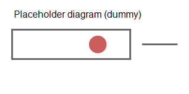

# 心停止と CPR

【要確認】動作確認用のダミー原稿です。処置の内容は確認していません。Circulation を入れた Dev 版の内容として書く。
出典: [ACE Anvil – Medical（Dev）](https://anvil.acemod.org/dev/components/medical/)（2026-09-25 確認）
関連: [止血](hemorrhage.md)

## 心停止の見分け方

<!-- tags: CA, 心肺停止 -->

【要確認】心停止（Cardiac arrest）の兆候を確認する。

## CPR の手順

1. 【要確認】CPR を始める。
2. 【要確認】続ける時間は公式ドキュメントで確認する。

## エピネフリンの役割

> [!IMPORTANT]
> 【要確認】Circulation を入れると、エピネフリンの役割が変わる（意識回復は炭酸アンモニウムに移る）。
